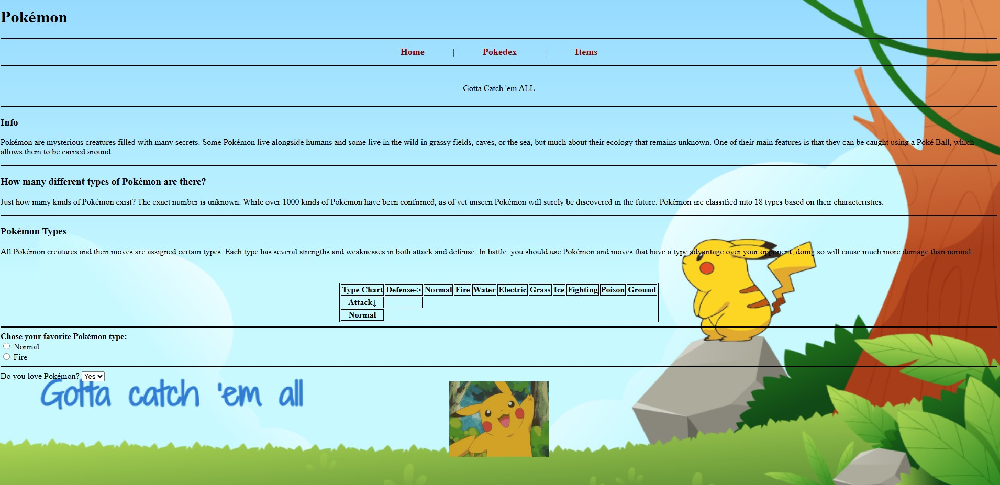

<h1>Pokémon Gotta Catch 'em ALL</h1>

This project is a simple webpage about everyone's FAVORITE, Pokémon, on the homepage I divided the informations about Pokémon into different sections including a <b>table</b> for Pokémon types and <b>form</b>. I also made two other pages besides the homepage as Pokédex and Items. Pokédex page shows all pokémon evolutions using flexbox to organize images. In the Items page by using <b>table</b> I was able to show all items that exists in the pokémon world such as evolution items, hold items for boosts during trainer battles etc. By incorporating <b>hr</b> tags and background image, the format is consistent with all pages.

